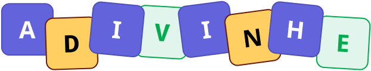

# Adivinhe

<p align="center">
  
</p>

Jogo de adivinhação de palavras relacionadas à programação, desenvolvido com React e TypeScript. Use a dica para descobrir a palavra, confirmando uma letra por vez.

## Como jogar

1. Leia a dica da palavra sorteada.
2. Digite uma letra no campo **Palpite** e clique em **Confirmar**.
3. As letras corretas são reveladas nas posições correspondentes da palavra.
4. Consulte o histórico para acompanhar os acertos e erros. Uma letra repetida não conta como uma nova tentativa.
5. Descubra a palavra antes de esgotar as tentativas: o limite é o número de letras da palavra mais cinco.

O botão de reiniciar permite sortear um novo desafio e limpar o progresso, após confirmação.

## Funcionalidades

- Sorteio de palavras com dicas individuais.
- Revelação de todas as ocorrências de uma letra correta.
- Histórico de letras utilizadas com cores para acertos e erros.
- Contador de tentativas.
- Validação de palpites vazios e letras repetidas.
- Reinício da partida.

## Tecnologias

- **React 19** — componentes e gerenciamento de estado com hooks.
- **TypeScript** — tipagem dos componentes e dos desafios.
- **Vite 7** — servidor de desenvolvimento e build.
- **CSS Modules** — estilos por componente.

## Executando localmente

Use Node.js **22.12 ou superior** e npm.

Clone ou baixe este repositório e abra um terminal na pasta do projeto. Instale as dependências:

```bash
npm ci
```

Inicie o servidor de desenvolvimento:

```bash
npm run dev
```

Abra o endereço indicado no terminal, normalmente `http://localhost:5173`.

## Scripts disponíveis

| Comando | Descrição |
| --- | --- |
| `npm run dev` | Inicia o servidor de desenvolvimento. |
| `npm run build` | Verifica os tipos e gera a versão de produção em `dist/`. |
| `npm run preview` | Permite visualizar localmente o build de produção. |

Para visualizar a versão de produção, execute `npm run build` antes de `npm run preview`.

## Estrutura do projeto

```text
src/
├── assets/          # Logo e ícones
├── components/
│   ├── Button/      # Botão de confirmação
│   ├── Header/      # Logo, tentativas e reinício
│   ├── Input/       # Campo de palpite
│   ├── Letter/      # Exibição de uma letra
│   ├── LettersUsed/ # Histórico de palpites
│   └── Tip/         # Dica do desafio
├── utils/
│   └── words.ts     # Lista de palavras, dicas e tipo Challenge
├── App.tsx          # Estado e lógica do jogo
├── app.module.css   # Layout da aplicação
├── global.css       # Estilos globais
└── main.tsx         # Inicialização do React
```

## Adicionando palavras

Edite o array `WORDS` em [`src/utils/words.ts`](src/utils/words.ts) e adicione um objeto com um identificador único, uma palavra e sua dica:

```ts
{ id: 6, word: "NODE", tip: "Ambiente para executar JavaScript fora do navegador" },
```

Prefira palavras sem espaços ou acentos para manter a dinâmica atual de adivinhação por letras.
